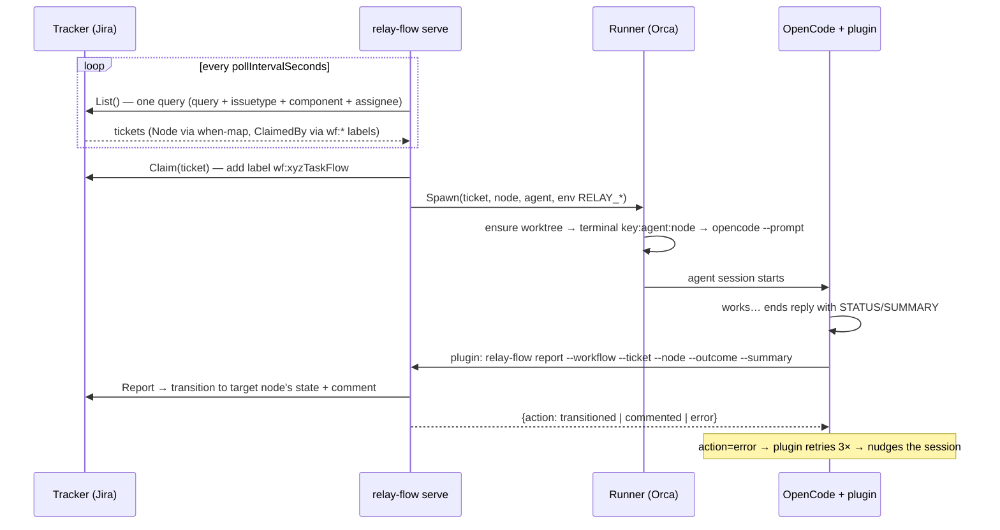
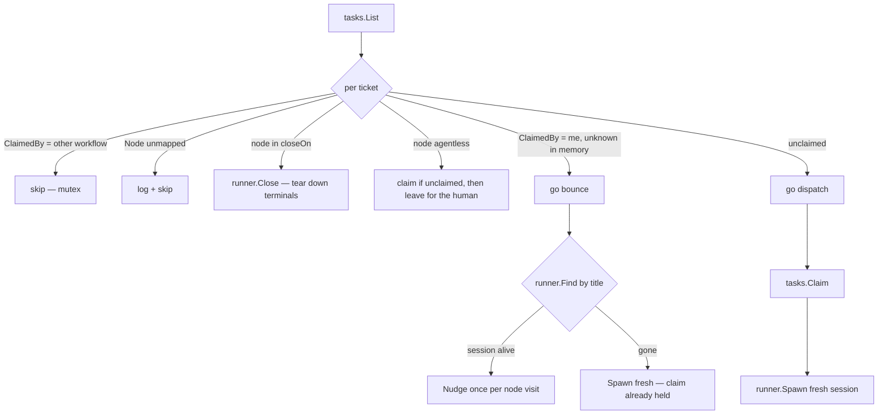
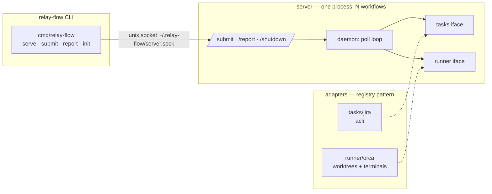

# relay-flow

Graph-based agent workflow engine. Tickets are tokens moving across **nodes**; each node has an **agent** (an OpenCode agent); the node's edges (`onSuccess`/`onFailure`) decide where the token goes next. The tracker (Jira built-in) is the scoreboard; the runner (Orca built-in) is the playing field. Both are pluggable.

---

## Setup

### Prerequisites

| Tool | Why |
|---|---|
| [opencode](https://opencode.ai) | Agents run in opencode sessions |
| [Orca](https://github.com/Necmttn/orca) CLI + app | Worktrees + terminals (the built-in runner) |
| [acli](https://developer.atlassian.com/cloud/acli) | Jira access (the built-in tracker) |
| Go 1.21+ | Build the CLI |

### Install

```sh
# Homebrew:
brew install rajpopat27/tap/relay-flow

# npm (binary + `rf` shorthand):
npm install -g relay-flow

# prebuilt binary into ~/.local/bin:
curl -fsSL https://raw.githubusercontent.com/rajpopat27/relay-flow/main/install.sh | sh

# or with Go:
go install github.com/rajpopat27/relay-flow/cmd/relay-flow@latest
```

opencode plugin: add `"relay-flow-plugin"` to the `plugin` array in your repo's `opencode.json` (opencode auto-downloads it from npm on start):

```json
{
  "$schema": "https://opencode.ai/config.json",
  "plugin": ["relay-flow-plugin"]
}
```

(Or copy `plugin/report-status.ts` into your repo's `.opencode/plugin/` — committed so every ticket worktree inherits it. Use one method, not both, or it registers twice and reports twice.)

### Required configuration

1. **Machine identity** (per machine, never committed):
   ```sh
   relay-flow init --assignee "Jane Doe"     # Jira display name or accountId
   ```
   Writes `~/.relay-flow/config.yaml` (0600), probe-validated against Jira.

2. **Orca repo** — the repo must be registered in Orca (`orca repo add --path .`) with a base ref set (`orca repo set-base-ref --repo id:<id> --ref master`).

3. **Jira board transitions** must allow the moves your edges imply (e.g. To Do → In Progress → Testing → In Review → Done).

4. **Workflow YAML** at `.workflow/workflow.yaml` (committed, team-shared):

```yaml
name: xyzTaskFlow               # camelCase identity: registry key + claim label wf:<name>
pollIntervalSeconds: 15         # optional, default 15

tasks:                          # ticket-system adapter
  type: jira
  config:                       # opaque to core; strictly validated by the adapter
    query: project = ABCD       # JQL fragment (no issuetype/assignee/ORDER BY)
    issueTypes: [Task]
    assigneeIsAgent: true       # or omit → assignee comes from `relay-flow init`

runner:                         # execution backend
  type: orca

closeOn: [done]                 # terminal nodes whose tickets close their terminals

nodes:
  coding:
    agent: build                # OpenCode agent for this node
    when: "In Progress"         # tracker state routing tickets here (unique per file)
    onSuccess: reviewing        # outcome edges — required for agent nodes
    onFailure: coding           # self-loop allowed → comment only, no transition
    nudgePrompt: "..."          # optional; {{ticket}} {{node}} templates; sane default
  reviewing:
    agent: build                # the same agent may serve many nodes
    when: "In Review"
    onSuccess: done
    onFailure: coding
  done:
    when: "Done"                # no agent → terminal / human-gate node
```

Validation is strict and happens at submit: unknown fields, duplicate `when` values, dangling edges, agent nodes missing edges, and every referenced tracker state is probe-validated against the tracker.

### Run

```sh
relay-flow serve                            # central process (artifacts in ~/.relay-flow/)
relay-flow submit -f .workflow/workflow.yaml
relay-flow stop serve
```

`relay-flow report` is invoked by the plugin, not by hand.

---

## Architecture

### The board-game model

- **Nodes** are squares. Each maps to exactly one tracker state via `when`. One node = one state; the same agent may serve many nodes.
- **Agents** are robots sitting on squares. A ticket landing on an agent's square triggers work in a dedicated terminal/worktree.
- **Edges** (`onSuccess`/`onFailure`) are the only legal moves. Self-loops comment without transitioning (trackers have no self-transitions).
- **Terminal nodes** (in `closeOn`) tear down the ticket's terminals. **Agentless nodes** (no `agent:`) are human gates: the daemon claims the ticket (so other workflows skip it) but never spawns, nudges, or closes anything.
- The **tracker is the single source of truth**. The server holds no database; restart = resubmit, and claim labels (`wf:<name>`) survive to drive recovery.

### End-to-end sequence



### The poll-cycle 3-way switch



Claimed tickets are never touched by other workflows: the label is the cross-workflow mutex. "Claimed by me but unknown in memory" happens after a server restart — the bounce path re-finds the terminal by title (`<key>:<agent>:<node>`) and nudges it in place, preserving the agent's context instead of burning tokens on a fresh session.

### Components



| Component | Location | Role |
|---|---|---|
| opencode plugin | `plugin/report-status.ts` | Parses STATUS/SUMMARY deterministically, calls `relay-flow report` (thin socket client), retries/nudges |
| CLI | `cmd/relay-flow/` | `serve` hosts workflows; `submit` registers one; `report` is a one-shot client |
| daemon | `internal/daemon/` | Poll loop, 3-way switch, dispatch/bounce goroutines |
| server | `internal/server/` | Socket lifecycle, submit validation, report routing |
| config | `internal/config/` | Workflow YAML schema + graph validation |
| Jira adapter | `internal/tasks/jira/` | [readme](internal/tasks/jira/README.md) — query/claim/report over acli |
| Orca adapter | `internal/runner/orca/` | [readme](internal/runner/orca/README.md) — worktrees, terminals, prompts |

### Key invariants

- **Fail fast**: everything validates at submit — YAML structure, graph shape, tracker states, assignee, adapters' configs.
- **No fallback paths**: report goes through the server or not at all; server down = system down (the plugin's 3× retry + nudge covers transient gaps).
- **Labels are never removed**: `wf:<name>` is the crash-recovery anchor.
- **Terminals outlive their node visit** — a bounce reuses the session; only `closeOn` nodes close them.
- **Parallelism**: one long-lived poll goroutine per workflow; short-lived dispatch/bounce goroutines per ticket; tickets at the same node run in parallel terminals with isolated worktrees.

### Extending

New tracker (beads, Linear, GitHub): implement `tasks.Tasks` + register — see [tasks/jira README](internal/tasks/jira/README.md#writing-a-new-tasks-adapter-beads-linear-github-).
New execution backend (tmux, …): implement `runner.Runner` + register — see [runner/orca README](internal/runner/orca/README.md#writing-a-new-runner-tmux-).

## Development

```sh
go test ./... -race
go install ./cmd/relay-flow
```
