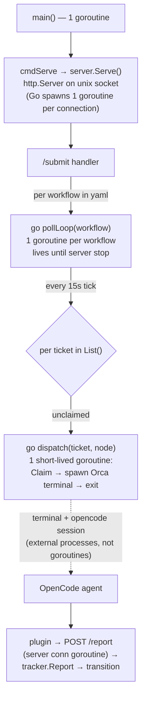
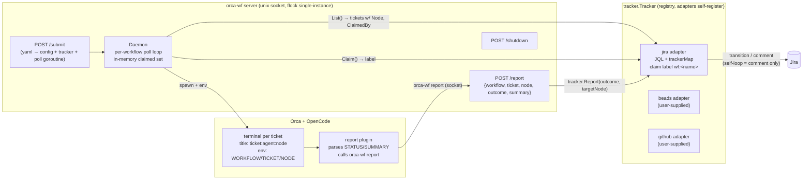
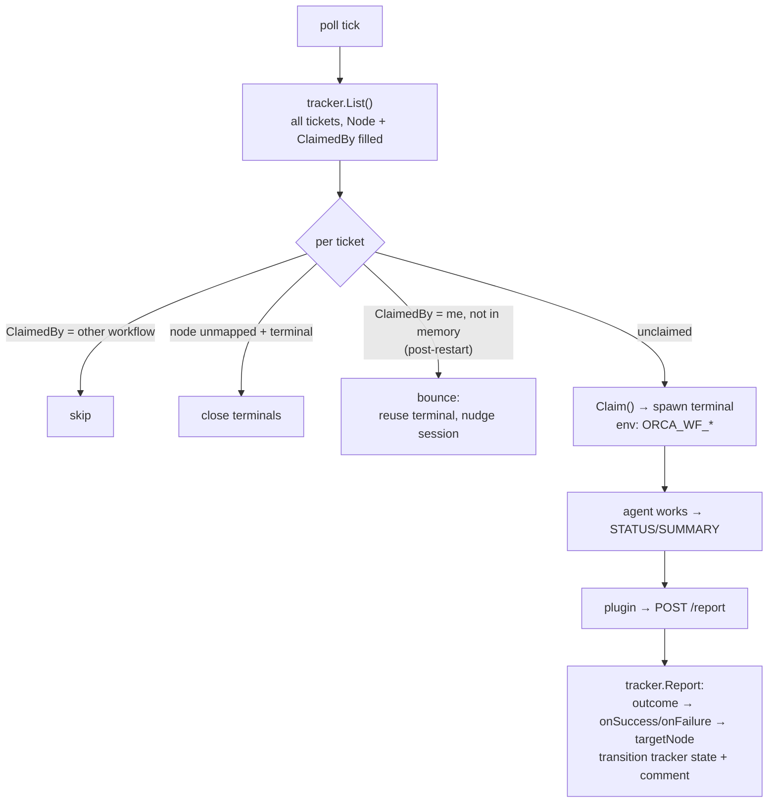
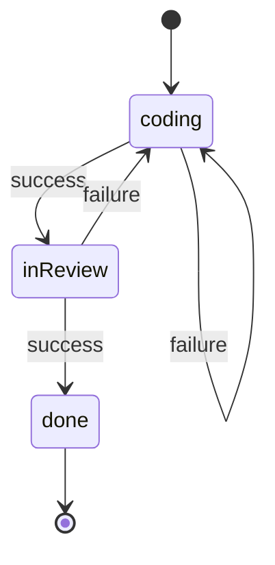

# v4 Architecture — Tracker-Agnostic Workflow Engine

## ELI5

Imagine a board game where each ticket is a token moving across squares. The squares (nodes) are yours to name. Each square has a robot (agent) sitting on it. When a token lands on a square, the robot does its job, then says either "success" or "failure" — and the square's own rulebook (onSuccess/onFailure) says which square the token moves to next. Jira is just the scoreboard where the token's position is written down; swap Jira for beads and only the scoreboard-keeper changes, not the game.

## End-to-end walkthrough (one ticket, one workflow)

```mermaid
sequenceDiagram
    participant U as User
    participant S as Server
    participant P as Poll loop
    participant J as Jira adapter
    participant T as Terminal (OpenCode)
    participant PL as Plugin

    U->>S: submit workflow.yaml (name: xyzFlow)
    S->>S: validate v4, build jira tracker, start poll goroutine
    loop every 15s
        P->>J: List()
        J->>J: JQL search; map status→node via trackerMap
        J-->>P: [GHCOS-1 node=coding, ClaimedBy=""]
        P->>J: Claim(GHCOS-1) → label wf:xyzFlow
        P->>T: spawn worktree terminal<br/>title GHCOS-1:coder:coding<br/>env WORKFLOW/TICKET/NODE
        T->>T: agent codes, ends with STATUS/SUMMARY
        T->>PL: session.idle
        PL->>S: POST /report {xyzFlow, GHCOS-1, coding, success, summary}
        S->>J: Report(GHCOS-1, success → inReview)
        J->>J: transition GHCOS-1 → "In Review" + comment
        S-->>PL: {action: transitioned}
    end
    Note over P,J: next tick: GHCOS-1 now node=inReview<br/>→ reviewer agent spawns, same dance
    Note over P: server restart? resubmit → claimed tickets<br/>come back as bounce (nudge existing terminal)
```


## Goroutine map



Goroutines: 1 per workflow poll loop (long-lived), 1 per ticket dispatch (short-lived), 1 per socket connection (Go stdlib). Terminals/agents are OS processes, not goroutines.

## Component view



## Poll cycle (per workflow)



## Example node graph (yaml)



```yaml
nodes:
  coding:   {agent: coder,    onSuccess: inReview, onFailure: coding}
  inReview: {agent: reviewer, onSuccess: done,     onFailure: coding}
  done: {}                       # terminal
trackerMap:                      # jira adapter interprets
  coding: "In Progress"
  inReview: "In Review"
  done: "Done"
```
